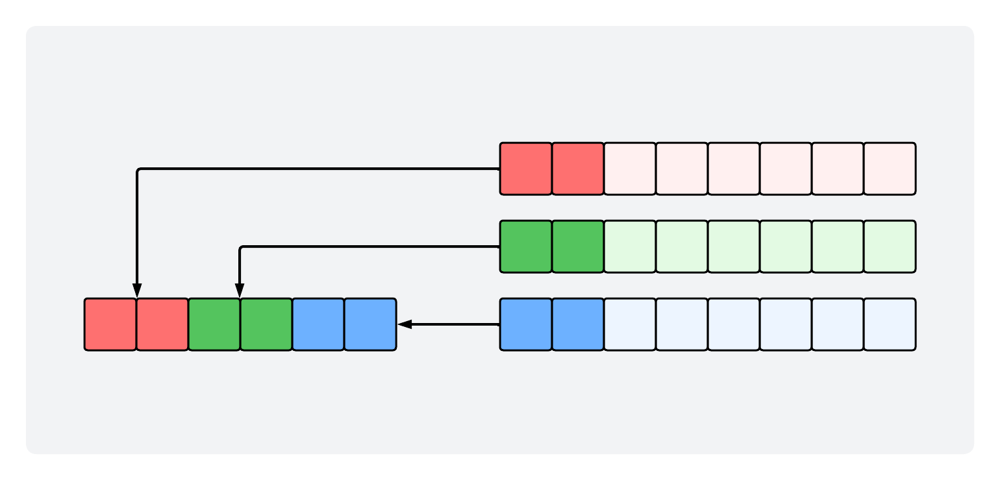

# Content-Based Image Retrieval System with Relevance Feedback

## Description

This project implements a simple Content-Based Image Retrieval (CBIR) system
that utilizes color histogram comparison techniques, specifically focusing on
two methods: Intensity method and Color-Code method. These methods transform
color values into histogram, which serve as the basis for the image comparison.
The system also incorporates a simplified relevance feedback mechanism to
enhance retrieval results.

## Table of Contents

- [Getting Started](#getting-started)
- [Color Histogram](#color-histogram)
- [Histogram Comparison](#histogram-comparison)
- [Relevance Feedback](#relevance-feedback)

## Getting Started

Follow the steps below to compile and run the program:

1. clone repo to your local machine
2. navigate to the source directory:

    ```bash
    cd src/main/java/cbir/
    ```

3. use `javac` command to compile the java files:

    ```bash
    javac -d . *.java
    ```

4. run the program:

    ```bash
    java cbir.Main
    ```

Alternatively, you can open and run the project using an IDE such as CLion.

## Color Histogram

### Intensity

The Intensity method combines the 24-bit RGB color (8 bits per channel) into a
single intensity value using the formula:

$Intensity = 0.299R + 0.587G + 0.114B$

The histogram bins for this method are defined as follows:

- `H01: I ∈ [000,010)`
- `H02: I ∈ [010,020)`
- `H03: I ∈ [020,030)`
- `...`
- `H25: I ∈ [240,255)`

### Color-Code

The Color-Code method transforms the 24-bit RGB color intensities into a 6-bit
color code. It accomplishes this by extracting the two most significant bits
from each color component, as illustrated in the figure below.



This configuration of the 6-bit color code yields 64 histogram bins.

- `H01: 000000`
- `H02: 000001`
- `H03: 000010`
- `...`
- `H64: 111111`

For instance, to compute the color code value for the RGB color `(128, 0, 255)`,
follow these steps:

| Channel | Value | Channel Bitmap | Most Significant 2 bits |
|---------|-------|----------------|-------------------------|
| R       | `128` | `10000000`     | `10`                    |
| G       | `000` | `00000000`     | `00`                    |
| B       | `255` | `11111111`     | `11`                    |

Hence, the 6-bit color code value for `(128, 0, 255)` is `100011`, which is
obtained by combining the two most significant bits of each channel.

## Histogram Comparison

To determine how similar two images are, the distance metrics for histogram
comparison is used. The difference between two images, denoted as $i$ and $k$,
is calculated using the Manhattan distance formula, taking into consideration
the pixel count in each image. The calculation is as follows:

**Manhattan Distance: L1**

# $D_{i,k} = \sum_j | \frac{H_i(j)}{M_i \times N_i} - \frac{H_k(j)}{M_k \times N_k} |$

$`\text{Where:}`$

- $` M_i \times N_i = \text{the number of pixels in image } i. `$
- $` M_k \times N_k = \text{the number of pixels in image } k. `$

## Relevance Feedback

The Relevance Feedback mechanism enhances the retrieval process by incorporating
user feedback and iteratively adjusting feature weights based on that input.

This project employs a simplified relevance feedback mechanism, comprising five
phases:

1. Combine intensity and color code histograms for each image and normalize the feature matrix.
2. Gather user feedback: relevant and non-relevant images.
3. Compute new weights using the feature (sub) matrix of images marked as relevant.
4. Retrieval - apply the weights to each feature using values from step `3` to compute the distance matrix.
5. Subsequent RF iterations:
    - Obtain feedback from the user.
    - Update feature weights.
    - Repeat retrieval.

### Normalization

In the initial step of the RF process, intensity and color code histogram values
are combined. Here, the bin values for each image are normalized by dividing the
bin value by the image's size. Then, the entire feature matrix is normalized by applying the following formula:

# $V_k = \left( \frac{V_k - \mu_k}{\sigma_k} \right)$

where:

- $\mu_k = \text{average value of feature         } k.$
- $\sigma_k = \text{standard deviation of feature } k.$

Because a subset of images are used.

Note: because a given that a subset of images are used during the RF process,
      the sample standard deviation is employed when computing $\sigma_k$.

## $\sigma_k = \sqrt{ \frac{ \sum \left(X_i - avg \right)^2 }{N - 1}}$

### Distance Metric: Modified L1

When calculating the distance between two images using RF analysis, a modified
version of the Manhattan Distance formula is employed:

## $D(I, J) = \sum_i \omega_i \times | V_i(I) - V_i(J) |$

This version of the Manhattan distance incorporates the weight assigned to each
bin in the feature matrix. Moreover, the bins of the histogram are not
normalized by dividing them by the image size, as the feature matrix has
already been normalized in step `1`.

### Weight Calculation

Weight values for each feature are calculated using the following formulas:

**Initial weight value:**

## $W_i = \left( \frac{1}{\sigma_i} \right)$

**Normalized weight value:**

## $W_i = \left( \frac{W_i}{\sum W_i} \right)$

The normalized weight value is used in the RF analysis distance metric.
For initial query results, no bias is applied to the weights as they are all
assigned the same value. Weight values are only updated for subsequent queries
where the user has provided feedback regarding image relevance.

In cases where the standard deviation $\sigma_i$ for feature $i$ of all the
relevant marked images is $0$, the following steps are taken when updating
weight $W_i$ (where $m_i$ is the mean of feature $i$):

- if $m_i = 0$, set $W_i = 0$
- if $m_i \neq 0$, set $st_i$ = $\frac{min\{\sigma, \sigma \neq0\}}{2}$,
  and calculate $W_i$ as usual.
